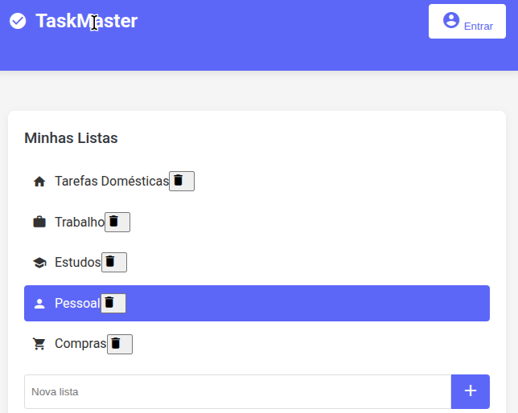

# TaskMaster - Gerenciador de Tarefas

## Descrição

Sistema completo de gerenciamento de tarefas com integração ao Google Calendar.

## Funcionalidades

- Gerenciamento de múltiplas listas de tarefas
- Sistema de prioridades (1-4)
- Datas de vencimento
- Integração com Google Calendar
- Armazenamento local no navegador
- Interface moderna e responsiva

## Como usar

1. Abra o arquivo `index.html` em qualquer navegador moderno
2. Crie listas e adicione tarefas
3. Organize por prioridade
4. Use o botão de calendário para agendar tarefas

## Estrutura do Projeto

- `index.html` - Página principal
- `scripts/main.js` - Ponto de entrada JavaScript
- `styles/main.css` - Estilos principais
- `modules/` - Módulos JavaScript organizados por funcionalidade

## Tecnologias

- HTML5
- CSS3
- JavaScript ES6
- Material Icons
- Google Fonts
